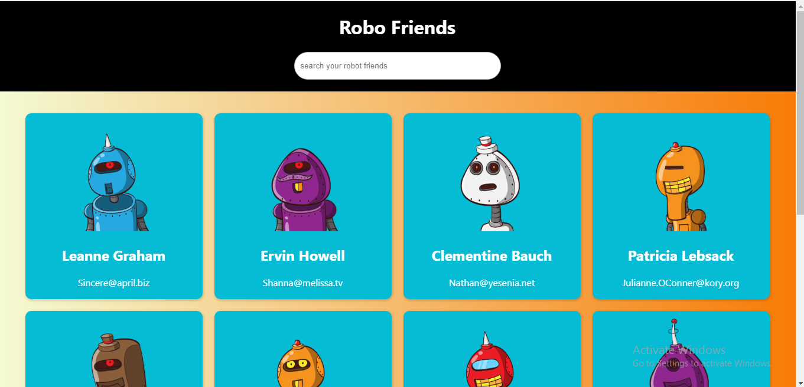

# Robofriends_Proj
RoboFriends React Project is a project developed to aid my undersatnding of using the React Library to develope a simple
application. The application collect different robot image from the Robohash api and display each image in card with names 
and email obtained from Json place holder. 

Here is a screenshot of the Robofriend App

